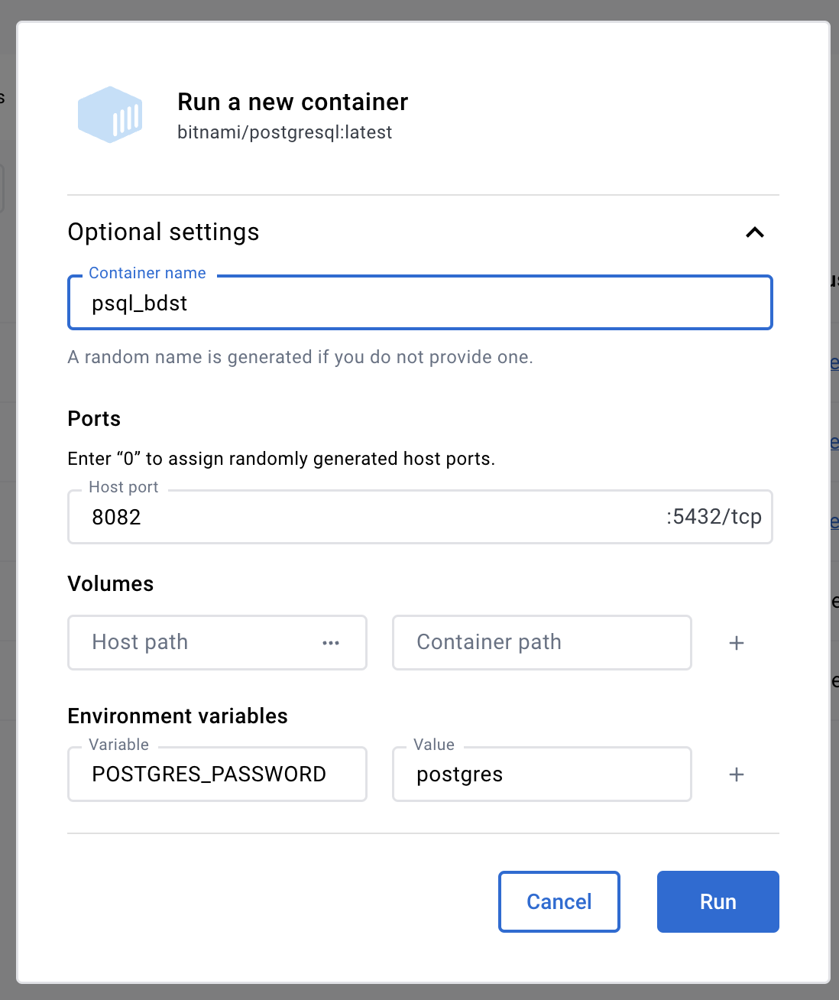

Лаба №2 по ТХБД
[формулировка задания](https://docs.yandex.ru/docs/view?url=ya-disk-public%3A%2F%2Faxn8Ln7MJyR0kI6FVA5m4HWBYQqv3F9y70f9qfAunGkwfHc9xvoCXg4FhLPqStb1q%2FJ6bpmRyOJonT3VoXnDag%3D%3D%3A%2FЛабораторная%20работа%202%20-%20SQL.pdf&name=Лабораторная%20работа%202%20-%20SQL.pdf)

### Шаг 1 - развернуть БД
Чтобы работать в базе данных, нужно ее создать. Я делаю это с помощью докера и образа [PostgreSQL](https://hub.docker.com/r/bitnami/postgresql?uuid=5E335F4D-A9C9-4496-9E72-3A7139C02DB0)
Поднимаем контейнер, в настройках вводим такие настройки

Все, база работает, можно подключаться как postgres/postgres по адресу localhost:8082

### Шаг 2 - создать базу внутри подключения, схему внутри базы
Чтобы создать базу внутри приложения, нужно в консоли докера прописать
```bash
psql -U postgres
postgres
```
```SQL
\l -- чтобы убедиться, что база одна (postgres)
CREATE DATABASE company;
\l -- чтобы убедиться, что company создалась
```
дальше выйти из терминала и подключиться через любой менеджер БД (например dbeaver) к постгресу (localhost:8082, postgres/postgres), выбрав базу данных company
теперь нужно открыть скрипт в этой базе и написать туда 
```SQL
CREATE SCHEMA dbo;
```
База и схема созданы